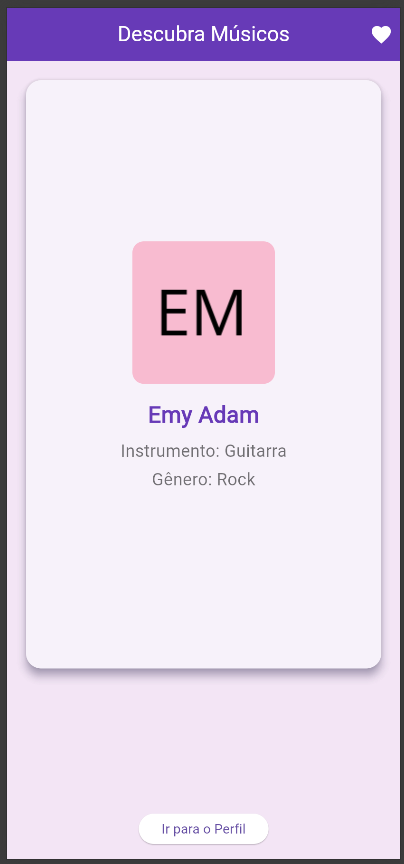
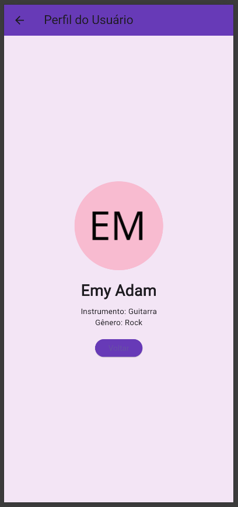
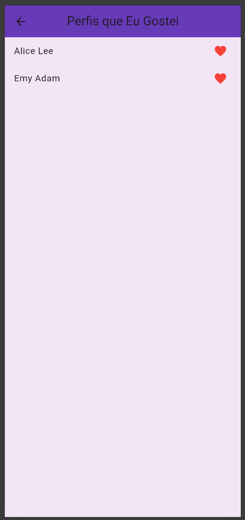

# 🎵 Musify 🎶

**Musify** é um aplicativo desenvolvido em **Flutter** para conhecer novas pessoas através dos seus gostos musicais! No app, você pode deslizar para fazer **matches** com músicos e descobrir perfis com gostos musicais similares aos seus.

## 📚 Projeto Acadêmico

Este é um projeto desenvolvido como parte da matéria **Desenvolvimento para Aplicações Mobile** do curso de **Sistemas de Informação**. O objetivo do projeto é criar um aplicativo funcional utilizando o Flutter, integrando conceitos de interfaces móveis, APIs e persistência de dados locais.

## Funcionalidades 🌟

- **🎶 Descubra Perfis Musicais**: Conheça músicos aleatórios e suas preferências musicais!
- **❤️ Match e Swipe**: Deslize para a direita para dar match ou para a esquerda para ignorar.
- **🌟 Tela de Favoritos**: Veja os perfis que você curtiu em uma tela de favoritos.
- **👤 Exibição de Perfil**: Acesse os detalhes do perfil de qualquer músico que você tenha dado match.

## Tecnologias Utilizadas 🔧

- **Flutter**: Framework para criação de aplicativos móveis.
- **API randomuser.me**: Para gerar perfis aleatórios de usuários.
- **Swipe Cards**: Biblioteca para implementar os cards deslizáveis no Flutter.
- **SharedPreferences**: Para salvar os perfis curtidos localmente.

## Pré-requisitos 🔑

Antes de rodar o projeto, você precisa ter:

- [Flutter](https://flutter.dev/docs/get-started/install) instalado.
- [Dart](https://dart.dev/get-dart) configurado.
- Um editor de código como [VS Code](https://code.visualstudio.com/).

## Como Rodar o Projeto 🚀

1. Clone o repositório:

    ```bash
    git clone https://github.com/viniciusVitorio/Musify.git
    ```

2. Navegue até o diretório do projeto:

    ```bash
    cd Musify
    ```

3. Execute o projeto:

    ```bash
    flutter run
    ```

## Estrutura do Projeto 📂

- **lib/**: Contém todo o código-fonte.
    - **main.dart**: Ponto de entrada do app.
    - **swipe_screen.dart**: Tela principal com os cards deslizáveis.
    - **match_screen.dart**: Tela de match entre dois perfis.
    - **profile_screen.dart**: Tela de exibição do perfil completo.
    - **liked_profiles_screen.dart**: Tela de perfis curtidos.

## Como Funciona? 🤔

1. **Tela Principal - Cards Musicais** 🎶:
    - Ao iniciar o app, você verá uma tela com perfis de músicos aleatórios.
    - O app utiliza a API `randomuser.me` para gerar perfis, incluindo o nome do músico, o instrumento, o gênero musical e uma imagem.
    - Deslize para a **direita** para dar **match** com o perfil, ou para a **esquerda** para **ignorar** o perfil.

2. **Tela de Favoritos - Seus Matches ❤️**:
    - Quando você der match com alguém, o perfil é salvo na sua lista de favoritos.
    - Clique no ícone de coração na barra superior para ver os perfis que você curtiu.

3. **Tela de Perfil - Detalhes do Músico 👤**:
    - Quando você clicar no botão "Ir para o Perfil", você será redirecionado para uma tela onde poderá ver os detalhes completos sobre o músico, como o instrumento e o gênero musical.

## Imagens 📸

Aqui estão algumas imagens do aplicativo em funcionamento:

- **Tela Inicial** com os perfis de músicos:<br>
    
  

- **Tela de Detalhes do Perfil**: <br>
    
  

- **Tela de Matches e Favoritos**: <br>
    

---
✨ **Obrigado por visitar o Musify!** ✨
